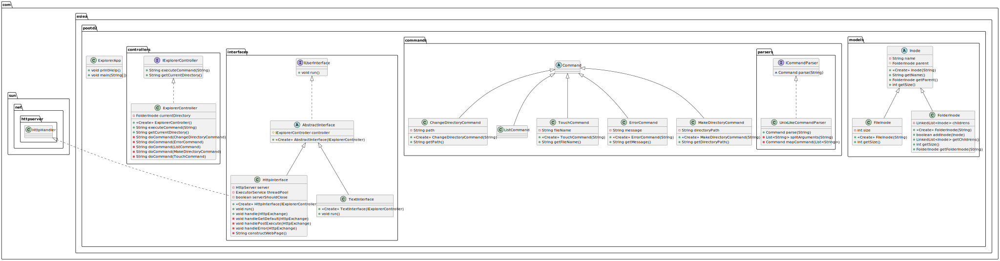

# Explorateur de Fichiers Virtuel

## Auteurs du projet

- **Vaizand Victor**
- **Rouault Alban**

## Description

Ce projet, réalisé dans le cadre du cours INF3132 (Programmation Orientée Objet - S5), est un explorateur de fichiers virtuel qui simule la navigation et la gestion d'un système de fichiers Unix-like. Il met en œuvre des concepts avancés de POO pour construire un système modulaire et extensible.

L'application supporte les commandes suivantes :
- `ls` : Liste le contenu du répertoire courant.
- `mkdir <chemin>` : Crée un nouveau répertoire (ainsi que ses parents).
- `cd <chemin>` : Change le répertoire courant.
- `touch <nom>` : Crée un nouveau fichier.
- `exit` : Quitte l'application.

L'utilisateur peut interagir avec l'application via une interface texte ou une interface HTTP.

## Fonctionnalités

### Fonctionnalités de base (conformément au sujet initial) :
1. **Navigation dans un système de fichiers virtuel** :
    - Représentation basée sur une structure arborescente avec des `Inodes`.
    - Classes pour les fichiers et répertoires : `FileInode`, `FolderInode`.
2. **Interprétation de commandes** :
    - Parsing des commandes utilisateur grâce à `UnixLikeCommandParser`.
    - Gestion des erreurs avec la commande `ErrorCommand`.
3. **Interface utilisateur** :
    - Mode interactif texte via `TextInterface`.

### Fonctionnalités Bonus

En plus des exigences de base, nous avons ajouté les fonctionnalités suivantes :

1. **README** :
   - Documentation succincte du projet.
2. **JavaDoc** :
   - Documentation Java générée, avec tout le code commenté en anglais.
3. **Commande mkdir améliorée** :
   - Amélioration de la commande `mkdir` permettant de créer un répertoire avec ses parents.
4. **Commande ls améliorée** :
   - Amélioration de la commande `ls` permettant de trier les résultats dans l'ordre alphabétique.
5. **Affichage du chemin absolu actuel** :
   - Affichage du chemin absolu actuel dans l'interface de la console (pas présent sur l'interface web).

## UML


Le diagramme UML ci-dessus illustre la structure et les interactions entre les différentes classes du projet.

## Installation

1. **Cloner le dépôt :**
   ```bash
   git clone https://github.com/albanrouault/ESIEA_INF3132_TD2
   cd ESIEA_INF3132_TD2
   ```

2. **Compiler le projet :**
   ```bash
   javac -d ef $(find src -name "*.java")
   ```

3. **Exécuter l'application :**
    - Mode texte :
      ```bash
      java -cp ef com.esiea.pootd2.ExplorerApp text
      ```
    - Mode HTTP :
      ```bash
      java -cp ef com.esiea.pootd2.ExplorerApp http
      ```

## Utilisation

### Exemple d'interactions :
```plaintext
/> mkdir docs
/> cd docs
/docs> touch notes.txt
/docs> ls
notes.txt	12543
/docs> cd ..
/> ls
docs	12543
/> exit
```

## Structure du projet

- **`com.esiea.pootd2`** : Package principal contenant le point d'entrée `ExplorerApp`.
- **`controllers`** : Contrôleurs gérant les interactions avec le système de fichiers.
- **`models`** : Représentation des fichiers et dossiers avec les classes `Inode`, `FileInode` et `FolderInode`.
- **`commands`** : Commandes disponibles (`ls`, `mkdir`, `cd`, `touch`).
- **`parsers`** : Parsing des commandes utilisateur (`UnixLikeCommandParser`).
- **`interfaces`** : Interfaces utilisateur (`TextInterface`, `HttpInterface`).

## Licence
Ce projet est sous licence [GNU General Public License v3.0](LICENSE).
